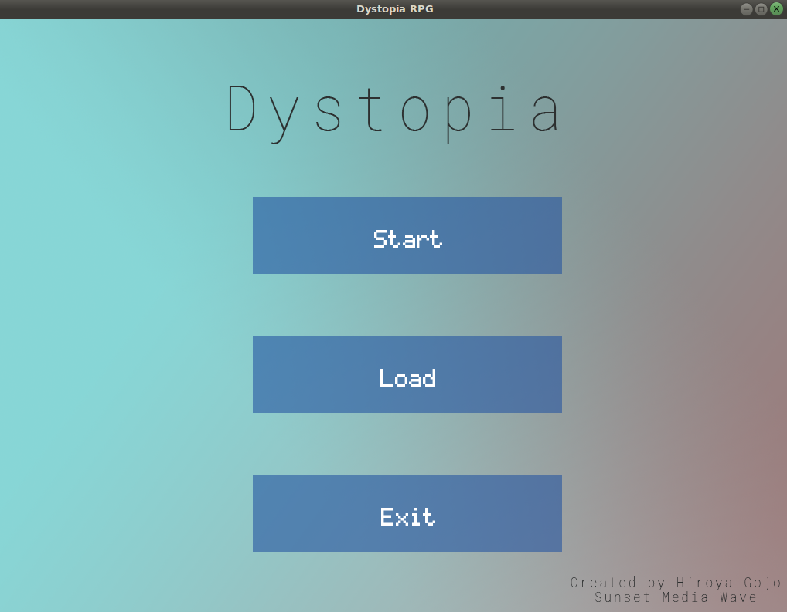
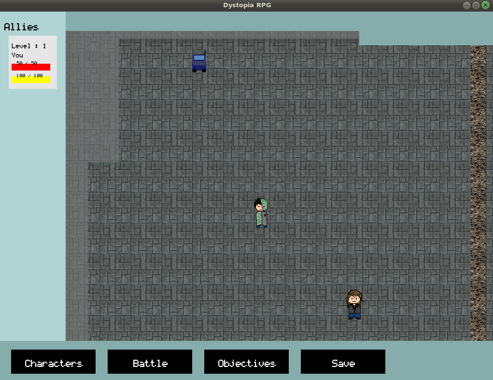
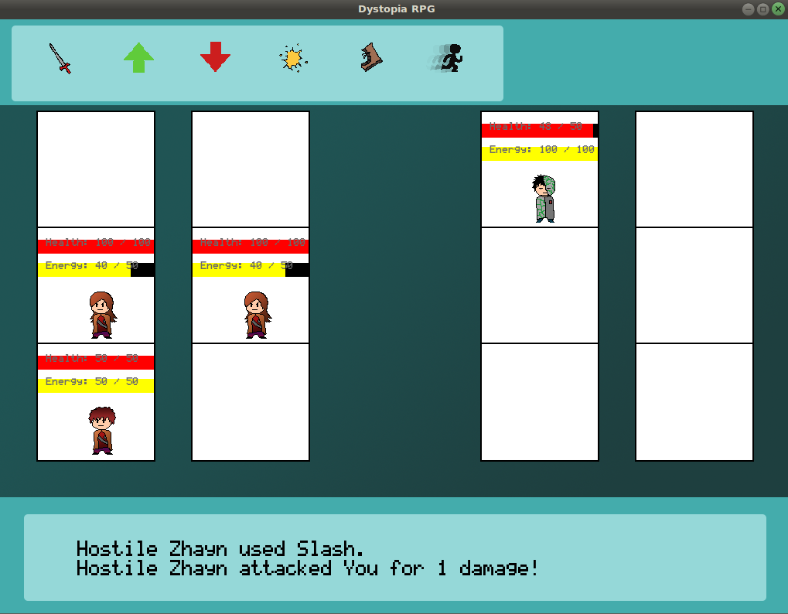

# dystopia-rpg
A story based RPG game of a dystopian and futuristic world. 

## Overview
This game was made in C++ and the SFML library. A more indepth write up can be found in the SunsetMedia Wave blog site [here](http://www.sunsetmediawave.org/category/column/from-zero-to-a-game/).  
I wanted to make a turn-based RPG with branching story lines.

### Screenshots

#### Time Spent
This project took about a year.  
I'd estimate that I spent 70% of the time writing code, 20% of the time drawing art, and 10% of the time brainstorming about the game. When writing code, I spent a majority of the time getting the battle system to work while less time was allocated to rendering the maps or programming the interactions between NPCs and the player.

#### Tools Used
I used the SFML graphics library. For creating the graphics, I used photoshop.

#### What Went Right
I was able to get the turn-based combat working. Players are able to talk to NPCs and the maps render correctly. Players can go to different maps. I also designed a working menu which allows players to add/remove allies from their party or change their equipment.

#### What Went Wrong
The scale of this game was too large for my experience. Although it was only my first time creating a game with SFML, I tried to make a complex storyline and gameplay with various intricacies which was out of my scope which ended up with decreased productivity. For instance, I had to spend a good amount of time learning what memory errors were and how to fix them. There are still a few bugs which causes the game to crash.

#### What Would I Change Next Time
I should understand what is realistic for me to create. After getting a basic version working, I got too ambitious adding plans for various stats and skills which got me to focus on the wrong parts of the game. I plan on gaining more experience by creating smaller scale games and finally coming back to creating my "dream RPG" game.

#### Conclusion
Although I wasn't able to meet the expectations of a complete game, I was able to learn a lot about how games work. I learned about the work needed to make a functioning game and the complexities with making a game. Unlike using a game engine, I was able to oversee every little detail in my game.
